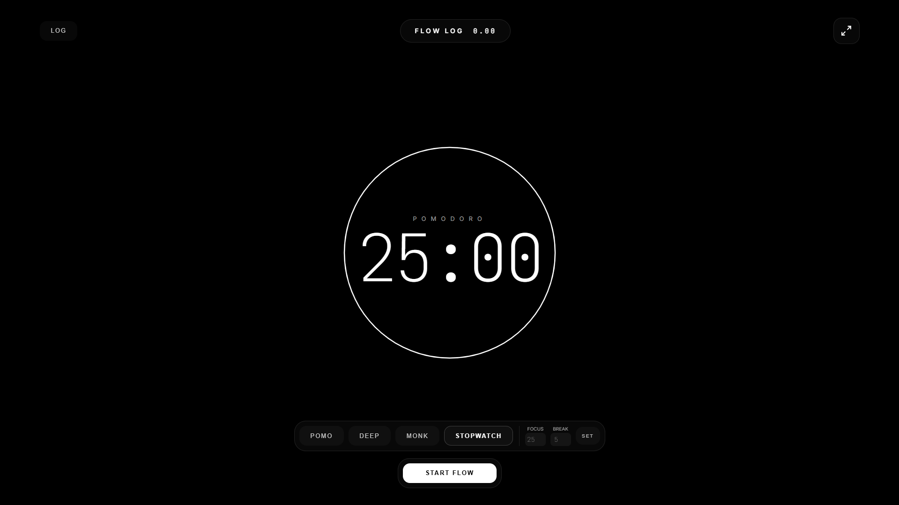

# FluX | Precision Focus Engine

FluX is a static, high-precision focus timer for deep work. It runs as a single HTML file with no build step, while still supporting accurate sessions, breaks, stopwatch mode, local history, daily stats, themes, sound, fullscreen, notifications, and refresh-safe running timers.



## Features

- Timestamp-based focus and break timers that stay accurate when the tab is backgrounded.
- Sprint, Flow, Deep Work, custom, and count-up stopwatch modes.
- Running sessions restore after refresh using saved timestamps.
- Session intention, manual logging, daily target progress, streaks, and all-time totals.
- Local-only data storage through `localStorage`.
- Sound, notification, fullscreen, and theme controls.
- Responsive static UI for desktop and mobile.

## Local Setup

Open `index.html` directly in a browser, or serve the folder with any static server:

```bash
python -m http.server 8000
```

Then visit `http://localhost:8000`.
